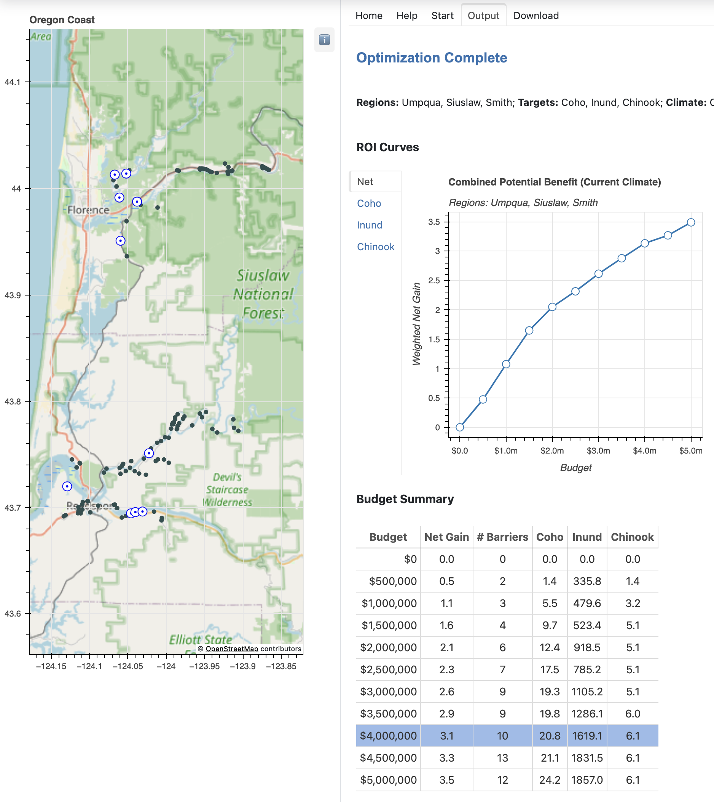

# Tide Gate Optimization
Estuaries are important transition zones between freshwater and marine ecosystems, providing essential habitat for both resident and migratory species.  Salmon, lamprey, and other aquatic species need to access streams and floodplains that are vital for their foraging, spawning, refuge, and rest.

For more than 100 years residents of the Oregon coast have created tide gates, levees, and other barriers to help control the tide and protect farm land, roads, building, and other infrastructure.  Many of the tide gates are failing and should be replaced with modern designs that meet current fish passage regulations.

The Oregon branch of [The Nature Conservancy](https://www.nature.org/en-us/about-us/where-we-work/united-states/oregon/) has developed a decision support system named the [**Tide Gate Optimization Tool**](https://oregontidegates.org/wp-content/uploads/2021/11/Oregons-Tide-Gate-Optimization-Tool-Supporting-Decisions-to-Benefit-Nature-and-People.pdf) to help landowners and other stakeholders balance the potential gain in benefits against the costs necessary to achieve those benefits.

## Web Application

The code in this repository is a web interface to the Tide Gate Optimization Tool.  It uses [Panel](https://panel.holoviz.org/) to display a GUI where users can enter optimization parameters -- which estuaries they are interested in, a range of costs to consider, and the benefits they hope to achieve.   


The GUI passes that information to the server, which runs the optimization algorithm.  The output is displayed in the GUI in the form of ROI curves and tables with detailed information about the tide gates included in the optimal solution.



### Installing the Server?  Read This First

The code for this web app is written entirely in Python and is open source.  Instructions for how to install and run the app can be found below.  

Before you get to that section, however, there are some important things to know about [OptiPass](https://www.ecotelligence.net/home/optipass), the program we use for computing optimal gate selections.

- OptiPass is free to use for non-commercial purposes, but for other uses a commercial license is required.

- We do not include an executable binary for OptiPass in this repo; if you want to set up your own server you will have to obtain a copy from the developer ([Ecotelligence LLC](https://www.ecotelligence.net/)).

- OptiPass comes with its own GUI, but the server runs a command line version of OptiPass.  Since OptiPass is a Windows application, the server either has to be a Windows system, or it has to use Wine to run OptiPass on a Linux or macOS system. 

We have deployed the server on a Windows VM at Amazon Cloud Services.  More information on how we set up our server can be found below in the sections on installing and running the server.

Another way to deploy the server is to use our Docker image.  Based on Ubuntu, it includes Wine so it can run OptiPass.  We don't recommend this approach, however, since OptiPass runs much more slowly than it does on a Windows host.  Details about how to launch a container so it can find the OptiPass binary on the host system are also described below.

### Configuring a Server for Other Geographical Regions

The tide gate data used by the web app is in a CSV file that is included in the repository.  Once you obtain a copy of OptiPass and follow all of the other installation steps you will be ready to run optimizations using data from estuaries on the Oregon coast.

Adapting this web app to work for other regions is mainly a matter of creating a new CSV file.  Each record in this file has the location, estimated replacement cost, and potential benefits for a single tide gate or other barrier.  

However there are other things that need to be configured, as well.  Details on the format of the CSV file and the other configuration steps are described in the **Configuration** section of the technical documentation.

## Downloading and Installing the Web App

The first step is to set up the execution environment.

- If you are installing this code on system that will run other Python applications we recommend creating and activating a new virtual environment with `venv`.  You will need Python 3.10 or later.

- If you are setting up a VM dedicated to just this application you can simply install Python 3.10 or later and add the libraries to the global environment.  Log in to your VM with an administrator account.

Obtain a copy of the repo, either by cloning it or downloading the `.zip` file.

Open a terminal and navigate to the directory.  You should see the following structure:

```bash
tidegates
├── Dockerfile
├── README.md
├── __init__.py
├── bin/
├── requirements.txt
├── sandbox/
├── static/
├── templates/
└── tidegates/
```

Use PIP to install all the dependencies:

```powershell
> python -m pip install -r requirements.txt
```

Move a copy of the OptiPass command line application to the `bin` directory.  After you do this that directory should have the `exe` file for OptiPass and some Python scripts that are part of the repo:

```powershell
> dir bin
Mode                LastWriteTime         Length Name
----                -------------         ------ ----
-a----         1/2/2023   4:45 PM        2699264 OptiPassMain.exe
-a----         1/2/2023   4:45 PM           1766 parse_optipass_results.py
-a----        7/12/2023   9:14 PM           2235 sanitize.py
```

## Running the Server


## Technical Documentation


