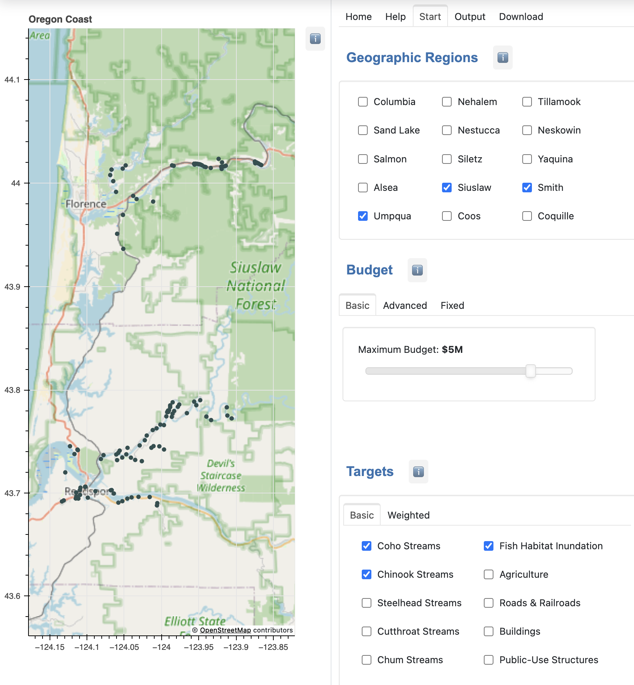
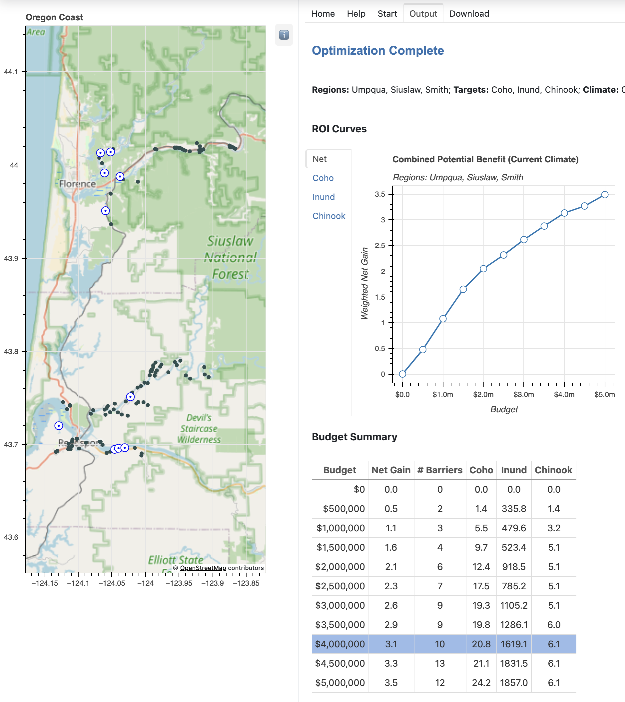

# Introduction

River estuaries are transition zones between freshwater and marine ecosystems.
They provide essential habitat for both resident and migratory species.  Salmon, lamprey, and other species need to access streams and floodplains that are vital for their foraging, spawning, refuge, and rest.

For more than 100 years residents of the Oregon coast have created tide gates, levees, and other barriers to help control the tide and protect farm land, roads, building, and other infrastructure.  Many of the tide gates are failing and should be replaced with modern designs that meet current fish passage regulations.

The Nature Conservancy has developed a decision support system named the [**Tide Gate Optimization Tool**](https://oregontidegates.org/wp-content/uploads/2021/11/Oregons-Tide-Gate-Optimization-Tool-Supporting-Decisions-to-Benefit-Nature-and-People.pdf) to help landowners and other stakeholders balance the potential gain and costs.  
The goal is to help users identify "the best bang for the buck": given a set of budget levels, which set of barriers will provide the most benefit for each budget? 

## Web Application

This document describes a web interface to the Tide Gate Optimization Tool.
The web application is written in Python, using [Panel](https://panel.holoviz.org/) to display a GUI where users can enter optimization parameters.

The screenshot below shows the the main interface.

#### Geographic Regions

The first section in the GUI shows the names of the estuaries in the data set.
The user simply clicks on next to the river's name to select the region(s) they are interested in.
All the gates in the selected regions are displayed on the map on the left side of the GUI.

#### Budget Levels

Potential benefits are often displayed as return on investment (ROI) curves.
To produce ROI curves the optimizer needs to be run at several different budget levels.
The simplest way to do this is to use the GUI to select a maximum budget level.
In the example shown the maximum is set at $5M (short for "5 million").
The optimization algorithm will be run 10 times, with budgets varying from $500,000 to $5,000,000 in increments of $500,000.

#### Optimization Goals

The last part of the GUI shown in this screenshot lets users specify their priorities (or "targets", using
the terminology from the optimization algorithm).
In this example the user has selected three different goals -- improving habitat for two species of fish and protecting farmland (or other acreage) in the inundation zone.
The optimization algorithm will take all of them into account as it selects the optimal set of gates.

## Outputs

When all the parameters are entered the user clicks a Run button (not shown in the screenshot).
When the results are ready they can be viewed by clicking the Output tab at the top of the screen, as shown in the example below.

#### ROI Curves

The top part of the window is where ROI curves will be displayed.
If more than one goal was specified there is a summary, labeled "Net", that shows the combined benefits at each budget level.
Benefits for individual targets can also be viewed by clicking the tab for that target.

#### Solution Details

Below that is a table that provides more detail about the gates identified by the optimization algorithm at each budget level.
There is one row for each budget.
The table entries for a row show the number of gates included in the optimal solution and the predicted benefit (the units are explained elsewhere in this documentation).

If the user clicks on a row in the table the map is updated to highlight the gates that are part of that solution.

## Documentation Overview

Click on any section in the menu bar to the left to read the documentation.

**User Instructions** has a more detailed discussion of how to use the web application, including additional ways of setting budget levels and how to specify weights for the optimization targets.

**Installation** is for systems administrators who want to set up their own web server to run the web application.

The **Developer** section has technical documentation for programmers intereseted in modifying or extending the application.

